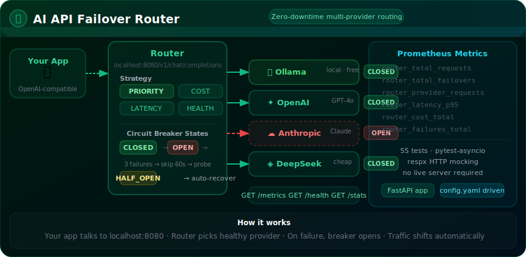

# AI API Failover Router

> Built autonomously by [NEO](https://heyneo.com) — your fully autonomous AI coding agent. &nbsp; [](https://marketplace.visualstudio.com/items?itemName=NeoResearchInc.heyneo)



A production-ready HTTP proxy for LLM APIs. Route any OpenAI-compatible request through a configurable chain of providers — Ollama, OpenAI, Anthropic, DeepSeek, or any OpenAI-compatible endpoint — with automatic failover, circuit breakers, and Prometheus metrics.

---

## Why This Exists

AI API outages, rate limits, and cost spikes are unpredictable. Most production apps hardcode a single provider and break when it does. This router solves that:

- **Zero downtime** — when your primary provider fails, traffic automatically shifts to the next healthy one
- **Cost control** — route cheapest-first, or set a per-request cost ceiling
- **One endpoint, any backend** — your app talks to `localhost:8080`, never knowing or caring which model actually answered
- **No vendor lock-in** — swap providers, add new ones, or run fully local (Ollama) without changing your app

---

## What It Does

```
Your App  ──►  localhost:8080/v1/chat/completions
                        │
                   Router decides:
                   ┌────────────────────────────────┐
                   │  Strategy: PRIORITY / COST /   │
                   │           LATENCY / HEALTH     │
                   └────────────────────────────────┘
                        │
          ┌─────────────┼─────────────┐
          ▼             ▼             ▼
      Ollama        DeepSeek       OpenAI
      (local)       (cheap)     (fallback)
          │             │             │
    Circuit         Circuit       Circuit
    Breaker         Breaker       Breaker
    (CLOSED)        (CLOSED)      (OPEN → skip)
```

When a provider fails 3 times, its circuit breaker opens. The router skips it for 60 seconds, then probes with a single request. If it recovers, the breaker closes and normal routing resumes — automatically.

---

## Why It Matters

| Without this router | With this router |
|--------------------|-----------------|
| App breaks when OpenAI has an outage | Automatic failover to Anthropic or local Ollama |
| Pay OpenAI rates for every request | Route to free Ollama first, pay APIs only when needed |
| No visibility into costs or latency | Per-provider Prometheus metrics, p50/p95/p99 latency |
| Changing providers requires code changes | Change `config.yaml`, no code changes |

---

## Routing Strategies

| Strategy | How it picks a provider |
|----------|------------------------|
| `PRIORITY` | Always try providers in configured order (1, 2, 3...) |
| `COST` | Route to the cheapest provider that's currently healthy |
| `LATENCY` | Route to the provider with lowest p95 response time |
| `HEALTH` | Route to the provider with the best circuit breaker state |

---

## Circuit Breaker States

```
CLOSED ──(3 failures)──► OPEN ──(60s timeout)──► HALF_OPEN ──(success)──► CLOSED
  │                        │                          │
Normal                  Blocked                  Test request
operation               (skipped)                 (1 allowed)
```

---

## Supported Providers

| Provider | Type | Auth |
|----------|------|------|
| Ollama | Local inference | None required |
| OpenAI | GPT-4o, GPT-4, GPT-3.5 | `OPENAI_API_KEY` |
| Anthropic | Claude 3.x | `ANTHROPIC_API_KEY` |
| DeepSeek | DeepSeek-V3 | `DEEPSEEK_API_KEY` |
| Generic | Any OpenAI-compatible API | Optional |

---

## Quick Start

### Install

```bash
pip install -r requirements.txt
```

### Configure providers in `config.yaml`

Set your provider chain and routing strategy. See the config file for full examples.

### Start the server

```bash
uvicorn src.main:app --host 0.0.0.0 --port 8080
```

### Use it like OpenAI

Point any OpenAI SDK or `curl` at `http://localhost:8080` — it speaks the same API format.

---

## API Surface

| Endpoint | Purpose |
|----------|---------|
| `POST /v1/chat/completions` | Main chat proxy (OpenAI-compatible) |
| `POST /v1/completions` | Legacy completions |
| `GET /health` | Per-provider health and circuit breaker state |
| `GET /metrics` | Prometheus metrics (latency, cost, failovers) |
| `GET /stats` | Human-readable JSON stats dashboard |
| `POST /admin/reset-circuit/{name}` | Manually reset a circuit breaker |
| `GET /admin/config` | View active configuration |

---

## Monitoring

The `/metrics` endpoint exposes Prometheus-format data:

- `router_total_requests` — total requests handled
- `router_total_failovers` — number of failover events
- `router_provider_requests{provider}` — requests per provider
- `router_latency_p95{provider}` — p95 response time per provider
- `router_cost_total{provider}` — estimated cost in USD
- `router_failures_total{provider}` — failure count per provider

---

## Project Structure

```
ml_project_0852/
├── src/
│   ├── main.py          # FastAPI app + endpoints
│   ├── router.py        # Failover logic + routing strategies
│   ├── health.py        # Circuit breaker + health checker
│   ├── metrics.py       # Rolling window latency + cost tracking
│   ├── middleware.py    # Request validation + rate limiting
│   ├── config.py        # YAML config loader + Pydantic models
│   └── providers/       # 5 provider implementations
│       ├── base.py
│       ├── ollama.py
│       ├── openai.py
│       ├── anthropic.py
│       ├── deepseek.py
│       └── generic.py
├── tests/               # 55 tests (config, providers, health, metrics, router)
├── config.yaml
├── requirements.txt
└── pytest.ini
```

---

## Running Tests

```bash
pytest tests/ -v
```

55 tests across 5 modules. All async tests use `pytest-asyncio`. No running server required.

---

## License

MIT
